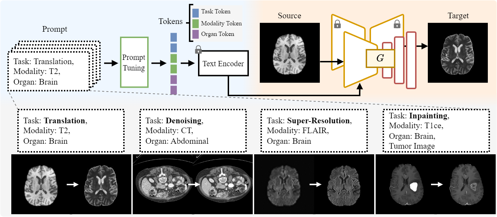
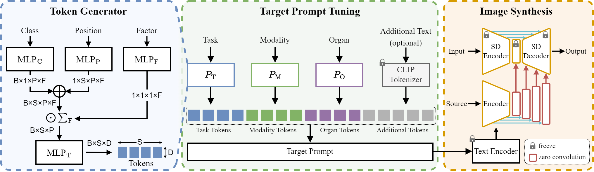

# Prompt Tuning for Task-agnostic Medical Image Synthesis


# Overview

This repository contains the code for Prompt Tuning for Task-agnostic Medical Image Synthesis. 

The model architecture is illustrated below: 



Our model's backbone is based on [ControlNet](https://github.com/lllyasviel/ControlNet). 

We would like to express our gratitude to everyone who contributed to the ControlNet code and model.

- [Adding Conditional Control to Text-to-Image Diffusion Models](https://arxiv.org/abs/2302.05543)

<br>



Our main contribution, prompt tuning, can be found in ldm/modules/encoders/modules.py. 

The above figure illustrates our prompt tuning.

<br>

## Requirements

First create a new conda environment

```
conda env create -f environment.yaml
conda activate control
pip install monai --no-deps
```

Then, you need to download the pretrained model from the following link. [ControlNet Hugging Face page](https://huggingface.co/thibaud/controlnet-sd21/tree/main)

<br>

## Training

Training can be started by running

```
python train.py
```

If you want to train on your own data, you need to modify ldm/data/dataset.py and train.py.

<br>

## Inference

You can perform inference with this 

```
python inference.py
```

If you want to train with your desired prompt, you can modify the source, target, and prompt in inference.py.

<br>

## Datasets

We utilized the Brain Tumor Segmentation challenge 2021(**BraTS 2021**) and Abdominal Multi-Organ Segmentation (**AMOS**) dataset. Accessible links are provided below. 

**BraTS 2021**: https://www.synapse.org/#!Synapse:syn25829067/wiki/610863 

**AMOS** :https://zenodo.org/records/7262581

<br>

